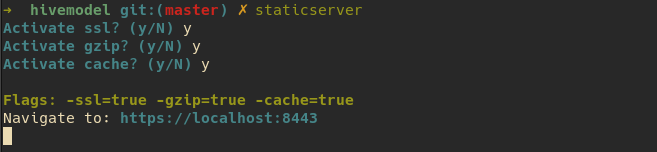

### staticserver
Localhost server for HTML, JS and CSS development with SSL.

### Usage

1. Download one of the files that match your OS.

- <a href="staticserver-darwin-amd64" download>darwin amd-64</a>
- <a href="staticserver-darwin-arm64" download>darwin arm-64</a>
- <a href="staticserver-linux-amd64" download>linux amd-64</a>
- <a href="staticserver-windows-amd64.exe" download>windows amd-64</a>

2. Rename executable and put into `PATH`:
- for Mac and Linux rename to `staticserver`
- for Windows rename to `staticserver.exe`

3. Navigate inside a folder with static files and run:

* `staticserver`: activate a prompt with different options.
* `staticserver -default`: skip the prompt and set all flags to false.
* `staticserver -ssl -gzip -cache`: set the three flags to true

Example:

### Localhost flags

- `ssl`: activate an HTTPS server
- `gzip`: activate gzip - `Content-Encoding: gzip`
- `cache`: activate cache - `Cache-Control: public, max-age=7776000`
- `default`: use this flag to start the server with all flags set to false

> The flags `ssl, gzip, cache` helps in obtaining 100% score in Google Lighthouse.